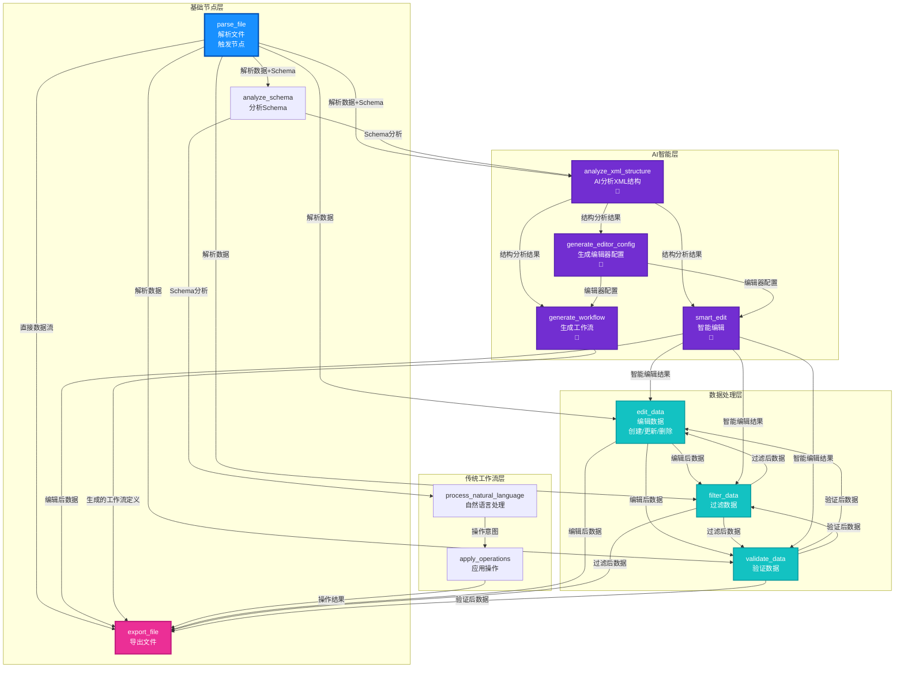
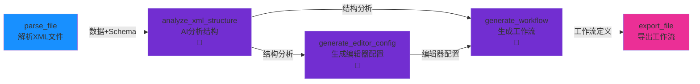

# StructForge AI - 工作流节点连接关系图

## 📊 节点分类总览

### 1. 基础节点（Foundation Nodes）
- **parse_file** - 解析文件（触发节点）
- **analyze_schema** - 分析Schema
- **export_file** - 导出文件（终止节点）

### 2. 数据处理节点（Data Processing Nodes）
- **edit_data** - 编辑数据（创建/更新/删除）
- **filter_data** - 过滤数据
- **validate_data** - 验证数据

### 3. AI智能节点（AI-Powered Nodes）
- **analyze_xml_structure** - AI分析XML结构
- **generate_editor_config** - 生成编辑器配置
- **smart_edit** - 智能编辑
- **generate_workflow** - 生成工作流

### 4. 传统工作流节点（Legacy Nodes）
- **process_natural_language** - 自然语言处理
- **apply_operations** - 应用操作

---

## 🔄 数据流关系图



---

## 🌟 典型工作流示例

### 示例1：基础XML编辑工作流


### 示例2：AI驱动的XML编辑工作流


### 示例3：完整AI工作流生成



---

## 📋 节点详细依赖关系表

| 节点类型 | 输入来源 | 输出去向 | 是否触发节点 |
|---------|---------|---------|-------------|
| **parse_file** | 无（文件路径） | 所有节点 | ✅ 是 |
| **analyze_schema** | parse_file | process_natural_language, analyze_xml_structure | ❌ |
| **edit_data** | parse_file, filter_data, validate_data, smart_edit | filter_data, validate_data, export_file | ❌ |
| **filter_data** | parse_file, edit_data, smart_edit | edit_data, validate_data, export_file | ❌ |
| **validate_data** | parse_file, edit_data, filter_data, smart_edit | edit_data, filter_data, export_file | ❌ |
| **analyze_xml_structure** | parse_file, analyze_schema | generate_editor_config, smart_edit, generate_workflow | ❌ |
| **generate_editor_config** | analyze_xml_structure | smart_edit, generate_workflow | ❌ |
| **smart_edit** | parse_file, analyze_xml_structure, generate_editor_config | edit_data, filter_data, validate_data, export_file | ❌ |
| **generate_workflow** | analyze_xml_structure, generate_editor_config | export_file | ❌ |
| **process_natural_language** | analyze_schema | apply_operations | ❌ |
| **apply_operations** | process_natural_language | export_file | ❌ |
| **export_file** | 所有节点 | 无（终止节点） | ❌ |

---

## 🔗 节点连接规则

### 1. 输入连接规则
- **触发节点**（parse_file）：只能作为起始节点，不能有输入连接
- **AI节点**：通常需要上游节点提供数据（如 analyze_xml_structure 需要 parse_file 的输出）
- **数据处理节点**：可以接受多个上游节点的输出
- **终止节点**（export_file）：可以接受任何节点的输出

### 2. 输出连接规则
- **parse_file**：可以连接到所有其他节点
- **AI节点**：输出特殊类型的数据（分析结果、配置、工作流定义）
- **数据处理节点**：输出处理后的数据，可以循环连接
- **export_file**：不输出数据，作为工作流的终点

### 3. 数据流类型

#### 基础数据流
```
parse_file → edit_data → filter_data → validate_data → export_file
```

#### AI增强数据流
```
parse_file → analyze_xml_structure → generate_editor_config → smart_edit → export_file
```

#### 混合数据流
```
parse_file → analyze_xml_structure → smart_edit → validate_data → export_file
```

---

## 🎯 节点功能映射

### 节点类型 → 功能分类

| 功能分类 | 节点类型 | 主要用途 |
|---------|---------|---------|
| **文件操作** | parse_file, export_file | 文件读写 |
| **数据分析** | analyze_schema, analyze_xml_structure | 结构分析 |
| **数据编辑** | edit_data, smart_edit | 数据修改 |
| **数据筛选** | filter_data | 数据过滤 |
| **数据验证** | validate_data | 数据校验 |
| **配置生成** | generate_editor_config | 编辑器配置 |
| **工作流生成** | generate_workflow | 工作流定义 |
| **自然语言** | process_natural_language | 意图理解 |
| **操作执行** | apply_operations | 操作应用 |

---

## 💡 使用建议

### 简单工作流
```
解析文件 → 编辑数据 → 导出文件
```

### 标准工作流
```
解析文件 → 过滤数据 → 编辑数据 → 验证数据 → 导出文件
```

### AI增强工作流
```
解析文件 → AI分析结构 → 生成编辑器配置 → 智能编辑 → 验证数据 → 导出文件
```

### 完整工作流
```
解析文件 → AI分析结构 → 生成编辑器配置 → 智能编辑 → 过滤数据 → 验证数据 → 导出文件
```

---

**最后更新**：2025-01-XX  
**版本**：v1.0.0

