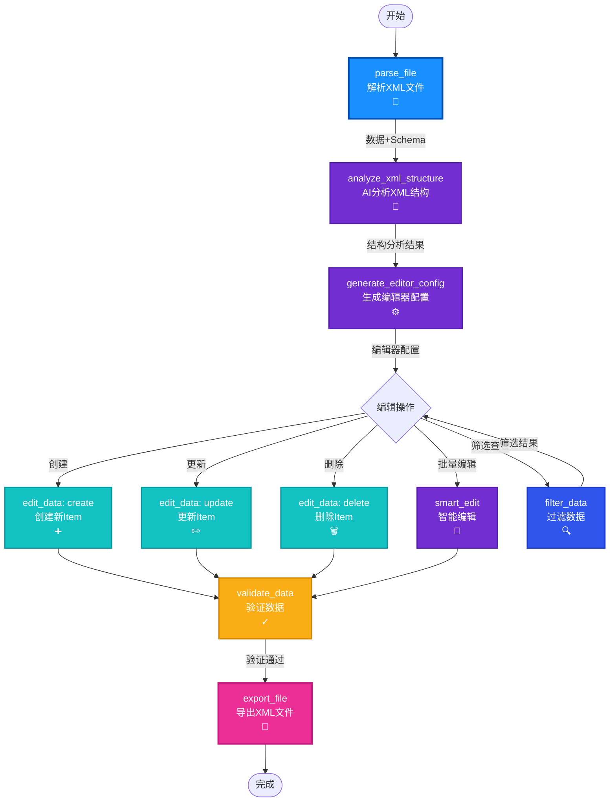

# StructForge AI - XML编辑器工作流实现计划

## 🎯 目标工作流

基于 `SkiOL_arm_armors.xml`，实现一个智能XML编辑器，能够：
- ✅ 自动识别任意XML结构
- ✅ AI理解字段含义和业务逻辑
- ✅ 生成智能编辑器配置
- ✅ 支持创建、编辑、修改、删除
- ✅ 验证和导出

---

## 📊 完整工作流连接图



---

## 📋 节点功能完善清单

### ✅ 已完成的节点（12个）

| 节点 | 功能 | 状态 | 完善度 |
|------|------|------|--------|
| parse_file | 解析XML文件 | ✅ | 90% |
| analyze_xml_structure | AI分析XML结构 | ✅ | 70% ⚠️ |
| generate_editor_config | 生成编辑器配置 | ✅ | 60% ⚠️ |
| edit_data | 创建/更新/删除 | ✅ | 70% ⚠️ |
| filter_data | 过滤数据 | ✅ | 80% |
| validate_data | 验证数据 | ✅ | 70% ⚠️ |
| smart_edit | 智能编辑 | ✅ | 75% |
| export_file | 导出文件 | ✅ | 60% ⚠️ |

### ⚠️ 需要完善的节点（按优先级）

#### 🔴 高优先级（立即完善）

**1. analyze_xml_structure - AI分析XML结构**

**当前问题**：
- 只分析结构层次，不理解业务含义
- 不识别枚举值和取值范围
- 不识别字段关联关系

**需要增强**：
```python
# 增强提示词，让AI理解业务逻辑
prompt = f"""
请深入分析以下XML数据结构（这是骑马与砍杀2的游戏装备配置文件）：

XML数据示例：
{request.xml_data}

请分析：

1. **业务领域识别**
   - 这是什么类型的数据？（游戏装备、配置文件、数据表等）
   - 主要用途是什么？

2. **枚举字段识别**
   - 识别所有可能的枚举值
   - 例如：Type=["HandArmor", "BodyArmor", ...]
   - 例如：culture=["Culture.aserai", "Culture.neutral_culture", ...]
   - 例如：modifier_group=["leather", "plate", "cloth"]
   - 例如：material_type=["Leather", "Plate", "Cloth"]

3. **数值范围识别**
   - 识别数值字段的合理范围
   - 例如：weight 范围 [0.1, 4.2]
   - 例如：arm_armor 范围 [6, 24]
   - 例如：difficulty, appearance 的范围

4. **字段关联关系**
   - modifier_group 和 material_type 的对应关系
   - 例如：modifier_group="leather" → material_type="Leather"
   - 例如：modifier_group="plate" → material_type="Plate"

5. **必填字段识别**
   - 哪些字段是必需的？（如 id, name, Type）
   - 哪些字段是可选的？（如 is_merchandise, difficulty）

6. **编辑建议**
   - 为每个字段提供默认值建议
   - 为每个字段提供验证规则建议
   - 为每个字段提供编辑提示

请返回JSON格式，包含：
- business_domain: 业务领域描述
- enum_fields: {字段名: [可能值列表]}
- numeric_ranges: {字段名: {min, max, default}}
- field_relationships: [{field1, field2, relation_type}]
- required_fields: [必填字段列表]
- edit_suggestions: {字段名: {default, validation, hint}}
"""
```

**2. generate_editor_config - 生成编辑器配置**

**当前问题**：
- 生成的配置比较基础
- 没有枚举下拉选项
- 没有验证规则
- 没有合理的默认值

**需要增强**：
```python
# 利用结构分析结果生成更智能的配置
prompt = f"""
根据以下XML结构分析结果，生成一个完整的、智能的编辑器配置。

XML结构分析：
{request.xml_structure}

编辑器类型：{request.editor_type}

请生成JSON格式的编辑器配置，包含：

1. **fields配置**（每个字段包含）：
   - name: 字段名（支持嵌套路径，如 "ItemComponent.Armor.arm_armor"）
   - label: 显示标签（中文，易懂）
   - type: 字段类型（text, number, select, switch, textarea）
   - required: 是否必填
   - default: 默认值（基于结构分析结果）
   - validation: 验证规则
     - 数值字段：min, max
     - 文本字段：pattern, maxLength
   - options: 下拉选项（如果是枚举字段，从结构分析中获取）
   - placeholder: 占位符提示
   - tooltip: 字段说明
   - group: 分组（用于UI布局）

2. **layout布局**：
   - sections: 分组配置
     - title: 分组标题
     - fields: 字段列表
     - collapsible: 是否可折叠
   - field_order: 字段显示顺序

3. **operations操作**：
   - create: 支持创建
   - update: 支持更新
   - delete: 支持删除
   - batch: 支持批量操作

4. **validation_rules验证规则**：
   - 基于结构分析的验证规则
   - 字段关联验证（如 material_type 和 modifier_group 的对应）

5. **paths数据路径**：
   - item_path: Item列表路径（如 "Items.Item"）
   - attribute_paths: 属性路径映射

示例字段配置：
{{
  "name": "Type",
  "label": "装备类型",
  "type": "select",
  "required": true,
  "default": "HandArmor",
  "options": ["HandArmor", "BodyArmor", "LegArmor"],
  "tooltip": "装备的类型，决定装备的用途"
}}
"""
```

**3. edit_data - 编辑数据**

**当前问题**：
- 只支持单个操作
- 没有批量操作支持
- 操作界面不够友好

**需要增强**：
```python
# 在 EditDataRequest 中添加批量操作支持
class EditDataRequest(BaseModel):
    data: Dict[str, Any]
    operation: str  # create, update, delete, batch_create, batch_update, batch_delete
    path: str
    item_data: Optional[Union[Dict[str, Any], List[Dict[str, Any]]]] = None  # 支持数组
    filter_condition: Optional[Dict[str, Any]] = None

# 在 edit_data 端点中实现批量操作
if request.operation == "batch_create":
    items = request.item_data if isinstance(request.item_data, list) else [request.item_data]
    created_items = []
    for item in items:
        # 创建逻辑
        created_items.append(new_item)
    return {"success": True, "created_count": len(created_items), "data": updated_data}

elif request.operation == "batch_update":
    # 批量更新匹配 filter_condition 的所有Item
    updated_count = 0
    for item in target_list:
        if _match_filter(item, request.filter_condition):
            # 更新逻辑
            updated_count += 1
    return {"success": True, "updated_count": updated_count, "data": updated_data}
```

**4. export_file - 导出文件**

**当前问题**：
- 可能不支持XML格式化
- 不保留原始格式

**需要增强**：
```python
# 在 files.py 中添加 export 端点
@router.post("/export")
async def export_file(request: ExportFileRequest):
    """
    导出文件
    
    - format: xml, json, yaml
    - pretty_print: 是否美化
    - preserve_format: 是否保持原始格式
    - sort_by: 排序字段（可选）
    """
    if request.format == "xml":
        from lxml import etree
        # 将数据转换为XML
        root = etree.Element("Items")
        for item in data.get("Items", {}).get("Item", []):
            item_elem = etree.SubElement(root, "Item")
            # 添加属性
            for key, value in item.get("@attributes", {}).items():
                item_elem.set(key, str(value))
            # 添加子元素
            # ...
        
        # 格式化输出
        xml_string = etree.tostring(
            root, 
            pretty_print=request.pretty_print,
            encoding='utf-8',
            xml_declaration=True
        ).decode('utf-8')
        
        return {"content": xml_string, "format": "xml"}
```

#### 🟡 中优先级（后续完善）

**5. filter_data - 过滤数据**
- 添加可视化查询构建器
- 支持多条件组合（AND/OR）
- 保存常用查询

**6. validate_data - 验证数据**
- 基于结构分析自动生成验证规则
- 自定义验证规则支持
- 验证结果可视化

**7. smart_edit - 智能编辑**
- 更好的上下文理解（利用结构分析和编辑器配置）
- 支持批量自然语言编辑

---

## 🚀 实现步骤

### 第一步：完善 analyze_xml_structure（高优先级）

**目标**：让AI理解XML的业务含义，不仅仅是结构

**实现**：
1. 增强提示词，要求AI识别：
   - 业务领域
   - 枚举字段及其可能值
   - 数值字段范围
   - 字段关联关系
   - 必填字段
   - 编辑建议

2. 更新响应解析，提取这些信息

### 第二步：完善 generate_editor_config（高优先级）

**目标**：生成包含枚举、验证、布局的智能配置

**实现**：
1. 利用结构分析结果生成配置
2. 为枚举字段生成下拉选项
3. 为数值字段生成范围验证
4. 为嵌套字段生成分组布局
5. 生成字段默认值建议

### 第三步：完善 edit_data（高优先级）

**目标**：支持批量操作

**实现**：
1. 添加批量操作类型：`batch_create`, `batch_update`, `batch_delete`
2. 支持 `item_data` 为数组
3. 改进批量操作的响应格式

### 第四步：完善 export_file（高优先级）

**目标**：支持XML格式化和美化

**实现**：
1. 使用 `lxml` 进行XML格式化
2. 支持美化输出选项
3. 支持排序选项
4. 保留XML注释（如果原始文件有）

---

## 📝 具体实现建议

### 1. 增强 analyze_xml_structure

**文件**：`backend/api/ai_workflow.py`

**修改点**：
- 增强 `analyze_xml_structure` 端点的提示词
- 要求AI返回枚举字段、数值范围、字段关联等信息

### 2. 增强 generate_editor_config

**文件**：`backend/api/ai_workflow.py`

**修改点**：
- 利用结构分析结果生成配置
- 为枚举字段生成下拉选项
- 为数值字段生成验证规则

### 3. 增强 edit_data

**文件**：`backend/api/data_operations.py`

**修改点**：
- 添加批量操作支持
- 更新 `EditDataRequest` 模型

### 4. 增强 export_file

**文件**：`backend/api/files.py` 或新建 `backend/api/export.py`

**修改点**：
- 添加 `export` 端点
- 实现XML格式化功能

---

## 🎨 前端编辑器界面设计

### 基于生成的配置动态生成表单

**位置**：`frontend/src/components/Workflow/NodeDetailPanel.tsx` 或新建编辑器组件

**功能**：
1. 读取 `generate_editor_config` 生成的配置
2. 根据配置动态生成表单字段
3. 支持分组显示（sections）
4. 支持下拉选择（options）
5. 支持数值验证（min/max）
6. 支持批量编辑（表格形式）

---

## ✅ 测试用例

### 测试工作流：编辑手臂铠甲XML

1. **解析文件**
   - 输入：`SkiOL_arm_armors.xml`
   - 验证：正确解析所有Item

2. **AI分析结构**
   - 验证：识别出枚举字段（Type, culture, modifier_group, material_type）
   - 验证：识别出数值范围（weight, arm_armor）
   - 验证：识别出字段关联（modifier_group ↔ material_type）

3. **生成编辑器配置**
   - 验证：为枚举字段生成下拉选项
   - 验证：为数值字段生成验证规则
   - 验证：生成合理的分组布局

4. **编辑数据**
   - 测试：创建新Item
   - 测试：更新现有Item
   - 测试：删除Item
   - 测试：批量操作

5. **验证数据**
   - 验证：必填字段检查
   - 验证：数值范围检查
   - 验证：字段关联检查

6. **导出文件**
   - 验证：XML格式化正确
   - 验证：保持原始结构
   - 验证：所有数据正确导出

---

## 📊 工作流节点连接关系

### 推荐工作流

```
parse_file 
  ↓
analyze_xml_structure (增强：业务逻辑理解)
  ↓
generate_editor_config (增强：智能配置生成)
  ↓
[编辑器界面 - 动态生成]
  ├─→ filter_data (筛选查看)
  ├─→ edit_data (单个编辑)
  ├─→ edit_data (批量编辑 - 需增强)
  └─→ smart_edit (自然语言编辑)
  ↓
validate_data (增强：自动验证规则)
  ↓
export_file (增强：XML格式化)
```

---

## 🎯 关键改进总结

| 节点 | 当前状态 | 需要完善 | 优先级 |
|------|---------|---------|--------|
| analyze_xml_structure | ✅ 基础分析 | 业务逻辑理解、枚举识别 | 🔴 高 |
| generate_editor_config | ✅ 基础配置 | 枚举选项、验证规则、布局 | 🔴 高 |
| edit_data | ✅ 单个操作 | 批量操作支持 | 🔴 高 |
| export_file | ✅ 基础导出 | XML格式化、美化 | 🔴 高 |
| filter_data | ✅ 基础过滤 | 可视化查询构建器 | 🟡 中 |
| validate_data | ✅ 基础验证 | 自动验证规则 | 🟡 中 |
| smart_edit | ✅ 基础编辑 | 更好的上下文理解 | 🟡 中 |

---

**下一步**：按照优先级依次完善这些节点功能。

