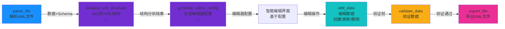
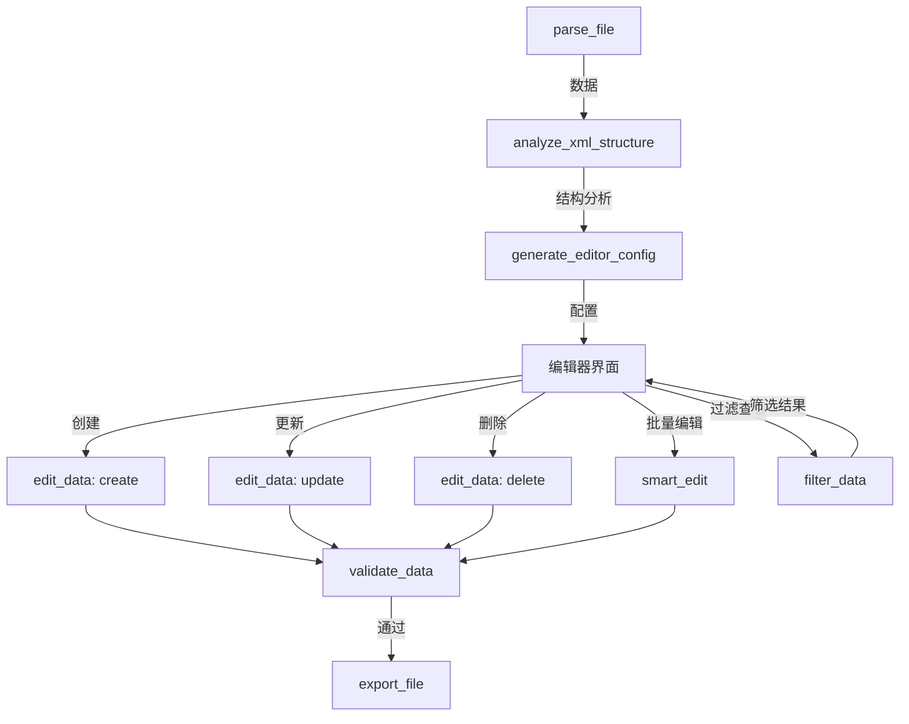

# StructForge AI - 智能XML编辑器工作流设计方案

## 📋 目标

基于 `SkiOL_arm_armors.xml`（骑马与砍杀2手臂铠甲）的XML结构，设计一个**智能、通用、易用**的XML编辑工具工作流，能够：
1. 自动识别任意XML文件的结构
2. 通过AI分析理解字段含义和业务逻辑
3. 生成适合的编辑器配置
4. 支持创建、编辑、修改、保存、删除操作
5. 对不同XML格式自动适配

---

## 🔍 XML结构分析

### 文件结构
```xml
<Items>
  <Item id="..." name="..." mesh="..." culture="..." weight="..." Type="HandArmor">
    <ItemComponent>
      <Armor arm_armor="..." modifier_group="..." material_type="..." />
    </ItemComponent>
    <Flags Civilian="true" Stealth="true" />
  </Item>
  <!-- 多个Item -->
</Items>
```

### 关键字段识别
- **Item属性**：id, name, mesh, culture, weight, difficulty, appearance, Type, is_merchandise
- **嵌套结构**：ItemComponent → Armor（arm_armor, modifier_group, material_type, covers_hands, stealth_factor）
- **Flags节点**：布尔属性（Civilian, Stealth等）

---

## 🎯 完整工作流设计

### 核心工作流（推荐）



### 扩展工作流（支持更多操作）



---

## 📊 节点功能分析

### ✅ 已有节点（12个）

| 节点类型 | 功能 | 状态 | 需要完善 |
|---------|------|------|---------|
| **parse_file** | 解析XML文件 | ✅ 完成 | 增强对复杂嵌套的支持 |
| **analyze_xml_structure** | AI分析XML结构 | ✅ 完成 | 需要理解业务逻辑（如Type="HandArmor"的含义） |
| **generate_editor_config** | 生成编辑器配置 | ✅ 完成 | 需要生成更智能的配置（下拉选项、验证规则） |
| **edit_data** | 创建/更新/删除 | ✅ 完成 | 需要支持批量操作界面 |
| **filter_data** | 过滤数据 | ✅ 完成 | 需要支持复杂查询界面 |
| **validate_data** | 验证数据 | ✅ 完成 | 需要支持自定义验证规则 |
| **smart_edit** | 智能编辑 | ✅ 完成 | 需要更好的上下文理解 |
| **export_file** | 导出文件 | ✅ 完成 | 需要支持XML格式化和美化 |
| **analyze_schema** | 分析Schema | ✅ 完成 | - |
| **process_natural_language** | 自然语言处理 | ✅ 完成 | - |
| **apply_operations** | 应用操作 | ✅ 完成 | - |
| **generate_workflow** | 生成工作流 | ✅ 完成 | - |

---

## 🚀 需要完善的节点功能

### 1. **analyze_xml_structure** - 增强业务逻辑理解

**当前功能**：分析XML结构层次和字段类型

**需要增强**：
- 理解字段的业务含义（如 `Type="HandArmor"` 表示这是手部护甲）
- 识别字段的枚举值（如 `culture` 的可能值：`Culture.aserai`, `Culture.neutral_culture`）
- 识别字段的取值范围（如 `weight`, `arm_armor` 的数值范围）
- 识别字段间的关联关系（如 `modifier_group` 和 `material_type` 的对应关系）

**实现建议**：
```python
# 在 ai_workflow.py 的 analyze_xml_structure 中增强提示词
prompt = f"""
请深入分析以下XML数据结构，特别关注：

1. 业务领域识别：这是什么类型的数据？（游戏装备、配置文件等）
2. 字段枚举值：识别所有可能的枚举值（如 culture, Type, modifier_group）
3. 数值范围：识别数值字段的合理范围（如 weight, arm_armor）
4. 字段关联：识别字段间的业务关联（如 material_type 和 modifier_group 的对应关系）
5. 必填字段：识别哪些字段是必需的
6. 编辑建议：为每个字段提供编辑建议（如默认值、验证规则）

请返回JSON格式，包含：
- business_domain: 业务领域
- enum_fields: 枚举字段及其可能值
- numeric_ranges: 数值字段的范围
- field_relationships: 字段关联关系
- required_fields: 必填字段列表
- edit_suggestions: 编辑建议
"""
```

### 2. **generate_editor_config** - 生成更智能的配置

**当前功能**：生成基本的编辑器配置

**需要增强**：
- 为枚举字段生成下拉选项（如 `culture`, `Type`, `modifier_group`, `material_type`）
- 为数值字段生成范围验证（如 `weight`, `arm_armor`）
- 为布尔字段生成开关控件（如 `Flags.Civilian`, `Flags.Stealth`）
- 为嵌套字段生成分组布局（如 `ItemComponent.Armor`）
- 生成字段的默认值建议

**实现建议**：
```python
# 在 generate_editor_config 中利用结构分析结果
prompt = f"""
根据以下XML结构分析结果，生成一个智能的编辑器配置。

结构分析：
{request.xml_structure}

特别注意：
1. 对于枚举字段（如 culture, Type），生成下拉选项列表
2. 对于数值字段（如 weight, arm_armor），生成范围验证规则
3. 对于布尔字段（如 Flags.Civilian），生成开关控件
4. 对于嵌套结构（如 ItemComponent.Armor），生成分组布局
5. 为每个字段提供合理的默认值

请返回JSON格式，包含：
- fields: 字段配置（包含 options, validation, default 等）
- layout: UI布局（包含 sections, groups）
- operations: 支持的操作（create, update, delete, batch）
- validation_rules: 验证规则
"""
```

### 3. **edit_data** - 增强批量操作支持

**当前功能**：支持创建、更新、删除单个条目

**需要增强**：
- 批量创建：支持一次创建多个Item
- 批量更新：支持批量修改符合条件的多个Item
- 批量删除：支持批量删除符合条件的多个Item
- 操作历史：记录操作历史，支持撤销/重做

**实现建议**：
```python
# 在 data_operations.py 中增强 edit 端点
@router.post("/edit")
async def edit_data(request: EditDataRequest):
    """
    支持批量操作
    - operation="batch_create": item_data 为数组
    - operation="batch_update": filter_condition 匹配多个，item_data 为更新内容
    - operation="batch_delete": filter_condition 匹配多个
    """
    if request.operation == "batch_create":
        # 批量创建
        items = request.item_data if isinstance(request.item_data, list) else [request.item_data]
        # ...
    elif request.operation == "batch_update":
        # 批量更新
        # ...
```

### 4. **export_file** - 增强XML格式化

**当前功能**：导出文件

**需要增强**：
- XML格式化：保持原始格式（缩进、换行）
- XML美化：美化输出格式
- 保留注释：保留XML注释
- 排序选项：支持按字段排序输出

**实现建议**：
```python
# 在 files.py 或新端点中实现
@router.post("/export")
async def export_file(request: ExportRequest):
    """
    - format: xml, json, yaml
    - pretty_print: 是否美化
    - preserve_format: 是否保持原始格式
    - sort_by: 排序字段
    """
    if request.format == "xml":
        # 使用 lxml 美化输出
        from lxml import etree
        root = etree.fromstring(xml_string)
        # 格式化输出
        return etree.tostring(root, pretty_print=True, encoding='unicode')
```

### 5. **filter_data** - 增强查询界面

**当前功能**：根据条件过滤数据

**需要增强**：
- 可视化查询构建器：支持图形化构建查询条件
- 多条件组合：支持 AND/OR 逻辑
- 保存查询：保存常用的查询条件
- 查询预览：实时预览查询结果

---

## 🆕 可能需要的新节点

### 1. **batch_operations** - 批量操作节点（可选）

如果 `edit_data` 的批量操作不够完善，可以单独创建：

```typescript
// 批量操作节点
type: 'batch_operations'
config: {
  operations: [
    { type: 'create', items: [...] },
    { type: 'update', filter: {...}, update: {...} },
    { type: 'delete', filter: {...} }
  ]
}
```

### 2. **preview_data** - 数据预览节点（可选）

在编辑前预览数据，确保正确：

```typescript
// 数据预览节点
type: 'preview_data'
config: {
  preview_mode: 'table' | 'json' | 'form',
  limit: 10  // 预览数量
}
```

### 3. **transform_data** - 数据转换节点（可选）

如果需要数据格式转换：

```typescript
// 数据转换节点
type: 'transform_data'
config: {
  transform_rules: [
    { field: 'weight', operation: 'multiply', value: 1.1 },
    { field: 'arm_armor', operation: 'add', value: 5 }
  ]
}
```

---

## 📝 完整工作流实现步骤

### 阶段1：基础工作流（当前可用）

```
parse_file → analyze_xml_structure → generate_editor_config → export_file
```

**功能**：
- ✅ 解析XML文件
- ✅ AI分析结构
- ✅ 生成编辑器配置
- ✅ 导出配置结果

### 阶段2：编辑工作流（当前可用，需完善）

```
parse_file → analyze_xml_structure → generate_editor_config 
→ edit_data (create/update/delete) → validate_data → export_file
```

**功能**：
- ✅ 解析和分析
- ✅ 生成配置
- ⚠️ 编辑数据（需增强批量操作）
- ✅ 验证数据
- ✅ 导出结果

### 阶段3：智能编辑工作流（当前可用）

```
parse_file → analyze_xml_structure → generate_editor_config 
→ smart_edit (自然语言编辑) → validate_data → export_file
```

**功能**：
- ✅ 解析和分析
- ✅ 生成配置
- ✅ 智能编辑（自然语言）
- ✅ 验证和导出

### 阶段4：完整编辑器工作流（推荐实现）

```
parse_file 
  ↓
analyze_xml_structure (AI分析结构，理解业务逻辑)
  ↓
generate_editor_config (生成智能编辑器配置，包含枚举、验证、布局)
  ↓
[编辑器界面 - 基于配置动态生成]
  ├─→ filter_data (按条件筛选查看)
  ├─→ edit_data (创建/更新/删除单个Item)
  ├─→ batch_operations (批量操作)
  └─→ smart_edit (自然语言编辑)
  ↓
validate_data (验证数据完整性)
  ↓
export_file (导出美化后的XML)
```

---

## 🎨 编辑器界面设计（基于生成的配置）

### 动态表单生成

根据 `generate_editor_config` 生成的配置，动态生成编辑器界面：

```typescript
// 示例：根据配置生成的表单
{
  fields: [
    {
      name: "id",
      label: "ID",
      type: "text",
      required: true,
      validation: { pattern: "^[a-z_]+$" }
    },
    {
      name: "Type",
      label: "装备类型",
      type: "select",
      options: ["HandArmor", "BodyArmor", "LegArmor"],
      default: "HandArmor"
    },
    {
      name: "weight",
      label: "重量",
      type: "number",
      validation: { min: 0, max: 10 },
      default: 1.0
    },
    {
      name: "ItemComponent.Armor.arm_armor",
      label: "护甲值",
      type: "number",
      validation: { min: 0, max: 100 },
      default: 10
    },
    {
      name: "Flags.Civilian",
      label: "民用装备",
      type: "switch",
      default: false
    }
  ],
  layout: {
    sections: [
      {
        title: "基础属性",
        fields: ["id", "name", "Type", "culture", "weight"]
      },
      {
        title: "护甲属性",
        fields: ["ItemComponent.Armor.*"]
      },
      {
        title: "标志",
        fields: ["Flags.*"]
      }
    ]
  }
}
```

---

## ✅ 节点完善清单

### 高优先级（必须完善）

1. **analyze_xml_structure**
   - [ ] 识别枚举字段及其可能值
   - [ ] 识别数值字段范围
   - [ ] 识别字段关联关系
   - [ ] 理解业务领域（游戏装备、配置等）

2. **generate_editor_config**
   - [ ] 为枚举字段生成下拉选项
   - [ ] 为数值字段生成范围验证
   - [ ] 为嵌套字段生成分组布局
   - [ ] 生成字段默认值建议

3. **edit_data**
   - [ ] 支持批量创建（`operation="batch_create"`）
   - [ ] 支持批量更新（`operation="batch_update"`）
   - [ ] 支持批量删除（`operation="batch_delete"`）
   - [ ] 改进操作界面（表格形式批量编辑）

4. **export_file**
   - [ ] 支持XML格式化（保持原始格式）
   - [ ] 支持XML美化（美化输出）
   - [ ] 支持排序选项
   - [ ] 保留XML注释

### 中优先级（建议完善）

5. **filter_data**
   - [ ] 可视化查询构建器
   - [ ] 支持多条件组合（AND/OR）
   - [ ] 保存常用查询

6. **validate_data**
   - [ ] 基于结构分析的自动验证规则
   - [ ] 自定义验证规则支持
   - [ ] 验证结果可视化

7. **smart_edit**
   - [ ] 更好的上下文理解（利用结构分析和编辑器配置）
   - [ ] 支持批量自然语言编辑

### 低优先级（可选）

8. **新增节点建议**
   - [ ] `batch_operations` - 专门的批量操作节点
   - [ ] `preview_data` - 数据预览节点
   - [ ] `transform_data` - 数据转换节点

---

## 🚀 实现优先级

### 第一阶段：核心功能完善（立即实现）

1. ✅ 完善 `analyze_xml_structure` - 增强业务逻辑理解
2. ✅ 完善 `generate_editor_config` - 生成更智能的配置
3. ✅ 完善 `edit_data` - 支持批量操作
4. ✅ 完善 `export_file` - XML格式化

### 第二阶段：用户体验优化（后续实现）

5. 完善 `filter_data` - 可视化查询
6. 完善 `validate_data` - 自动验证规则
7. 完善 `smart_edit` - 更好的上下文理解

### 第三阶段：扩展功能（可选）

8. 新增 `batch_operations` 节点
9. 新增 `preview_data` 节点
10. 新增 `transform_data` 节点

---

## 📊 工作流示例

### 示例：编辑手臂铠甲XML

```
1. parse_file (解析 SkiOL_arm_armors.xml)
   ↓ 输出：解析后的数据 + Schema

2. analyze_xml_structure (AI分析)
   ↓ 输出：
   - 业务领域：游戏装备配置
   - 枚举字段：Type=["HandArmor"], culture=["Culture.aserai", "Culture.neutral_culture"]
   - 数值范围：weight=[0.1-4.2], arm_armor=[6-24]
   - 字段关联：material_type 和 modifier_group 对应关系

3. generate_editor_config (生成配置)
   ↓ 输出：
   - fields: 所有字段配置（包含下拉选项、验证规则）
   - layout: 分组布局（基础属性、护甲属性、标志）
   - operations: [create, update, delete, batch]

4. [用户使用编辑器界面]
   - 创建新Item：填写表单（自动填充默认值，下拉选项）
   - 更新Item：选择Item，修改字段
   - 删除Item：选择Item，删除
   - 批量操作：选择多个Item，批量修改

5. validate_data (验证)
   ↓ 输出：验证结果（错误、警告）

6. export_file (导出)
   ↓ 输出：格式化后的XML文件
```

---

## 🎯 关键改进点总结

1. **AI分析增强**：让AI理解XML的业务含义，不仅仅是结构
2. **配置生成智能**：生成的编辑器配置要包含枚举、验证、布局等完整信息
3. **批量操作支持**：支持高效的批量编辑操作
4. **XML格式化**：导出时保持或美化XML格式
5. **用户体验**：提供直观的编辑界面，基于生成的配置动态生成

---

**最后更新**：2025-01-XX  
**设计版本**：v1.0.0

