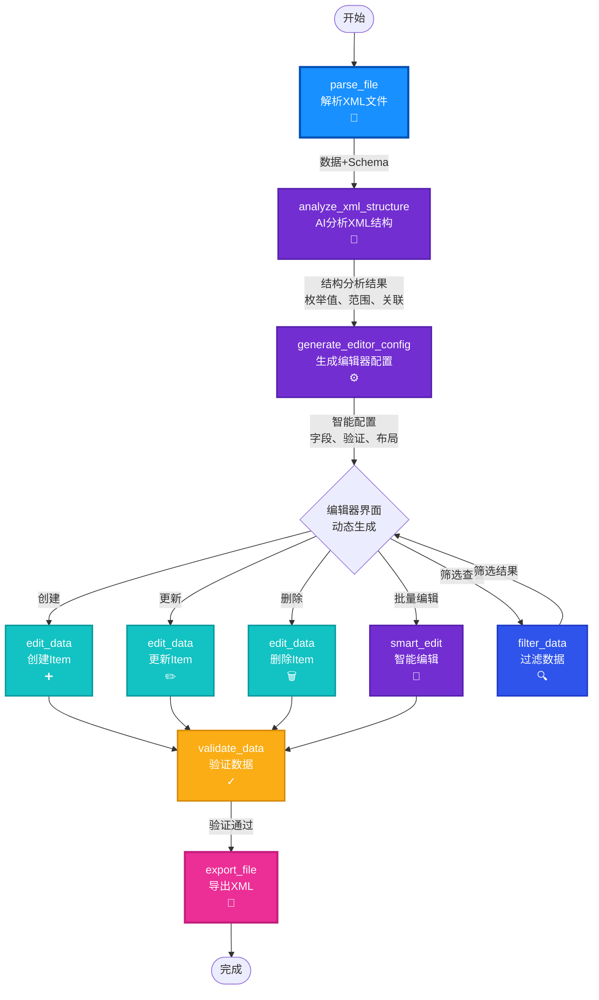

# StructForge AI - XML编辑器工作流节点连接图

## 🎯 目标工作流

基于 `SkiOL_arm_armors.xml`（骑马与砍杀2手臂铠甲），实现一个**智能、通用、易用**的XML编辑器。

---

## 📊 完整工作流连接图

### 核心工作流（推荐）



---

## 📋 节点功能与完善清单

### ✅ 已完成的节点（12个）

| 节点 | 功能 | 状态 | 完善度 | 需要完善 |
|------|------|------|--------|---------|
| **parse_file** | 解析XML文件 | ✅ | 90% | 增强复杂嵌套支持 |
| **analyze_xml_structure** | AI分析XML结构 | ✅ | 70% | 🔴 业务逻辑理解、枚举识别 |
| **generate_editor_config** | 生成编辑器配置 | ✅ | 60% | 🔴 枚举选项、验证规则、布局 |
| **edit_data** | 创建/更新/删除 | ✅ | 70% | 🔴 批量操作支持 |
| **filter_data** | 过滤数据 | ✅ | 80% | 🟡 可视化查询构建器 |
| **validate_data** | 验证数据 | ✅ | 70% | 🟡 自动验证规则 |
| **smart_edit** | 智能编辑 | ✅ | 75% | 🟡 更好的上下文理解 |
| **export_file** | 导出文件 | ✅ | 60% | 🔴 XML格式化、美化 |
| **analyze_schema** | 分析Schema | ✅ | 85% | - |
| **process_natural_language** | 自然语言处理 | ✅ | 80% | - |
| **apply_operations** | 应用操作 | ✅ | 75% | - |
| **generate_workflow** | 生成工作流 | ✅ | 70% | - |

---

## 🔴 高优先级完善项（立即实现）

### 1. analyze_xml_structure - 增强业务逻辑理解

**当前问题**：
- 只分析结构层次，不理解业务含义
- 不识别枚举值和取值范围
- 不识别字段关联关系

**需要增强**：
- ✅ 识别业务领域（游戏装备、配置文件等）
- ✅ 识别枚举字段及其可能值（Type, culture, modifier_group, material_type）
- ✅ 识别数值字段范围（weight: 0.1-4.2, arm_armor: 6-24）
- ✅ 识别字段关联关系（modifier_group ↔ material_type）
- ✅ 识别必填字段和可选字段
- ✅ 提供编辑建议（默认值、验证规则）

### 2. generate_editor_config - 生成智能配置

**当前问题**：
- 生成的配置比较基础
- 没有枚举下拉选项
- 没有验证规则
- 没有合理的默认值

**需要增强**：
- ✅ 利用结构分析结果生成配置
- ✅ 为枚举字段生成下拉选项（Type, culture, modifier_group, material_type）
- ✅ 为数值字段生成范围验证（weight, arm_armor）
- ✅ 为嵌套字段生成分组布局（ItemComponent.Armor）
- ✅ 生成字段默认值建议
- ✅ 生成字段关联验证规则

### 3. edit_data - 批量操作支持

**当前问题**：
- 只支持单个操作
- 没有批量操作支持

**需要增强**：
- ✅ 支持 `operation="batch_create"`（批量创建）
- ✅ 支持 `operation="batch_update"`（批量更新）
- ✅ 支持 `operation="batch_delete"`（批量删除）
- ✅ `item_data` 支持数组类型

### 4. export_file - XML格式化

**当前问题**：
- 可能不支持XML格式化
- 不保留原始格式

**需要增强**：
- ✅ 支持XML格式化（保持原始格式）
- ✅ 支持XML美化（美化输出）
- ✅ 支持排序选项
- ✅ 保留XML注释（如果原始文件有）

---

## 🟡 中优先级完善项（后续实现）

### 5. filter_data - 可视化查询构建器

- 可视化查询条件构建
- 支持多条件组合（AND/OR）
- 保存常用查询

### 6. validate_data - 自动验证规则

- 基于结构分析自动生成验证规则
- 自定义验证规则支持
- 验证结果可视化

### 7. smart_edit - 更好的上下文理解

- 利用结构分析和编辑器配置增强上下文
- 支持批量自然语言编辑

---

## 📝 工作流实现步骤

### 阶段1：基础工作流（当前可用）

```
parse_file → analyze_xml_structure → generate_editor_config → export_file
```

**功能**：
- ✅ 解析XML文件
- ✅ AI分析结构（基础）
- ✅ 生成编辑器配置（基础）
- ✅ 导出配置结果

### 阶段2：编辑工作流（当前可用，需完善）

```
parse_file → analyze_xml_structure → generate_editor_config 
→ edit_data (create/update/delete) → validate_data → export_file
```

**功能**：
- ✅ 解析和分析
- ✅ 生成配置（需增强）
- ⚠️ 编辑数据（需增强批量操作）
- ✅ 验证数据
- ✅ 导出结果（需增强XML格式化）

### 阶段3：完整编辑器工作流（推荐实现）

```
parse_file 
  ↓
analyze_xml_structure (增强：业务逻辑理解)
  ↓
generate_editor_config (增强：智能配置生成)
  ↓
[编辑器界面 - 基于配置动态生成]
  ├─→ filter_data (按条件筛选查看)
  ├─→ edit_data (单个编辑)
  ├─→ edit_data (批量编辑 - 需增强)
  └─→ smart_edit (自然语言编辑)
  ↓
validate_data (增强：自动验证规则)
  ↓
export_file (增强：XML格式化)
```

---

## 🎨 编辑器界面设计（基于生成的配置）

### 动态表单生成示例

根据 `generate_editor_config` 生成的配置，动态生成编辑器界面：

```typescript
// 示例：根据配置生成的表单字段
{
  fields: [
    {
      name: "id",
      label: "ID",
      type: "text",
      required: true,
      validation: { pattern: "^[a-z_]+$" },
      default: "new_item_id"
    },
    {
      name: "Type",
      label: "装备类型",
      type: "select",
      options: ["HandArmor", "BodyArmor", "LegArmor"],
      default: "HandArmor",
      required: true
    },
    {
      name: "culture",
      label: "文化",
      type: "select",
      options: ["Culture.aserai", "Culture.neutral_culture", "Culture.khuzait"],
      default: "Culture.neutral_culture"
    },
    {
      name: "weight",
      label: "重量",
      type: "number",
      validation: { min: 0.1, max: 10 },
      default: 1.0
    },
    {
      name: "ItemComponent.Armor.arm_armor",
      label: "护甲值",
      type: "number",
      validation: { min: 6, max: 24 },
      default: 10
    },
    {
      name: "ItemComponent.Armor.modifier_group",
      label: "修饰组",
      type: "select",
      options: ["leather", "plate", "cloth"],
      default: "leather"
    },
    {
      name: "ItemComponent.Armor.material_type",
      label: "材质类型",
      type: "select",
      options: ["Leather", "Plate", "Cloth"],
      default: "Leather",
      // 关联验证：如果 modifier_group="leather" 则 material_type 必须是 "Leather"
      validation: {
        depends_on: "ItemComponent.Armor.modifier_group",
        rules: {
          "leather": "Leather",
          "plate": "Plate",
          "cloth": "Cloth"
        }
      }
    },
    {
      name: "Flags.Civilian",
      label: "民用装备",
      type: "switch",
      default: false
    },
    {
      name: "Flags.Stealth",
      label: "潜行装备",
      type: "switch",
      default: false
    }
  ],
  layout: {
    sections: [
      {
        title: "基础属性",
        fields: ["id", "name", "Type", "culture", "weight", "mesh"]
      },
      {
        title: "护甲属性",
        fields: ["ItemComponent.Armor.*"]
      },
      {
        title: "标志",
        fields: ["Flags.*"]
      }
    ]
  }
}
```

---

## ✅ 节点完善清单总结

### 🔴 高优先级（立即完善）

1. **analyze_xml_structure** - 增强业务逻辑理解
   - [ ] 识别枚举字段及其可能值
   - [ ] 识别数值字段范围
   - [ ] 识别字段关联关系
   - [ ] 理解业务领域

2. **generate_editor_config** - 生成智能配置
   - [ ] 为枚举字段生成下拉选项
   - [ ] 为数值字段生成范围验证
   - [ ] 为嵌套字段生成分组布局
   - [ ] 生成字段默认值建议

3. **edit_data** - 批量操作支持
   - [ ] 支持 `batch_create`
   - [ ] 支持 `batch_update`
   - [ ] 支持 `batch_delete`
   - [ ] 改进操作界面

4. **export_file** - XML格式化
   - [ ] 支持XML格式化
   - [ ] 支持XML美化
   - [ ] 支持排序选项

### 🟡 中优先级（后续完善）

5. **filter_data** - 可视化查询构建器
6. **validate_data** - 自动验证规则
7. **smart_edit** - 更好的上下文理解

---

## 🚀 下一步行动

1. **立即完善** `analyze_xml_structure` - 增强业务逻辑理解
2. **立即完善** `generate_editor_config` - 生成智能配置
3. **立即完善** `edit_data` - 批量操作支持
4. **立即完善** `export_file` - XML格式化

完成这4个节点的完善后，工作流就能实现智能、通用的XML编辑功能！

---

**最后更新**：2025-01-XX  
**版本**：v1.0.0

